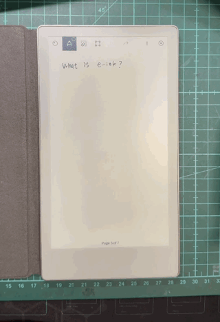
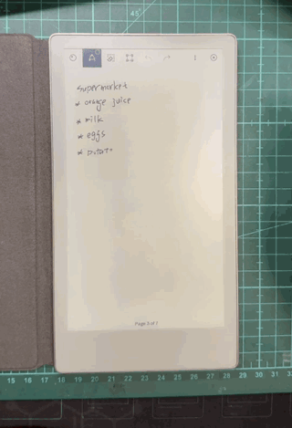
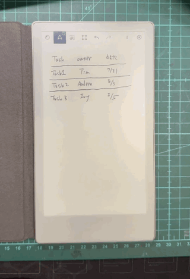
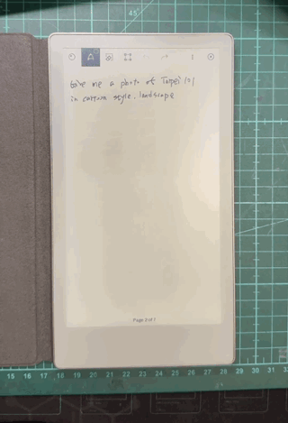
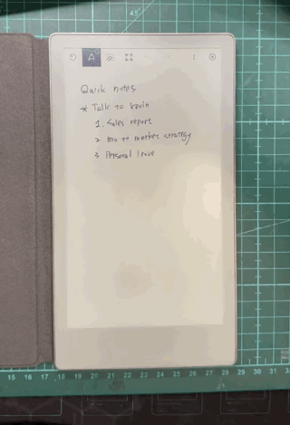
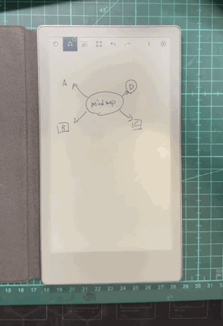

# Paper Agent

Paper Agent brings AI directly into the native selection menu on a reMarkable
Paper Pro Move. Lasso something in your notebook, then choose one of two actions:

<table>
  <tr>
    <td width="80" align="center">
      
    </td>
    <td>
      <strong>AI</strong><br>
      Understands the selected handwriting and creates a useful answer in the
      notebook.
    </td>
  </tr>
  <tr>
    <td width="80" align="center">
      
    </td>
    <td>
      <strong>Beautify</strong><br>
      Cleans up the selected handwriting or sketch without changing its meaning.
    </td>
  </tr>
</table>

Text, tables, and vector drawings are written back as native ink, so they remain
selectable, movable, resizable, and undoable. Generated pictures are inserted
as native notebook images.

> [!WARNING]
> Paper Agent is a developer preview for the Paper Pro Move (`chiappa`). It
> modifies the closed-source Xochitl UI through XOVI/QMD and may require updates
> after a reMarkable OS release. Back up important notebooks before testing.

## Features

<h3>
  
  AI
</h3>

Select a handwritten request and tap **AI**. Paper Agent chooses an output that
fits the request; one answer can also combine text, lists, code, and tables.

Click any demo to open the larger 320px version.

| What you write | What Paper Agent creates | Demo |
|---|---|---|
| Ask a question, request an explanation, or solve a calculation | A concise handwritten answer or a structured explanation | <a href="docs/assets/demos/ai-question-answer.gif"></a> |
| Ask for notes, a summary, an outline, or formatted content | A document with headings, paragraphs, lists, emphasis, and code | <a href="docs/assets/demos/ai-document.gif"></a> |
| Ask to organize information into rows and columns | A native table with wrapped, centered cells | <a href="docs/assets/demos/ai-table.gif"></a> |
| Ask for a photo, illustration, poster, painting, or other picture | A GPT-generated image inserted into the notebook | <a href="docs/assets/demos/ai-image.gif"></a> |

<h3>
  
  Beautify
</h3>

Select existing content and tap **Beautify**. Paper Agent treats the selection
as source material, never as a question or instruction. The original remains
untouched while the cleaned result is placed below it or on a new page.

| What you select | What Paper Agent creates | Demo |
|---|---|---|
| Rough handwriting, including Traditional Chinese and Latin text | A faithful, more legible handwriting transcription | <a href="docs/assets/demos/beautify-handwriting.gif"></a> |
| A rough diagram, flowchart, or labeled sketch | A faithful vector reconstruction with aligned shapes, straight connectors, and consistent labels | <a href="docs/assets/demos/beautify-diagram.gif"></a> |

## Install with Claude or Codex

The current release is for a Paper Pro Move with Developer Mode, XOVI, and
AppLoad already available. Instead of copying installation commands by hand,
open this repository in Claude Code or Codex and give it the following prompt:

```text
Install Paper Agent from this repository on my reMarkable Paper Pro Move.

Before changing the device:
1. Read README.md, docs/DEVELOPMENT.md, and docs/COMPATIBILITY.md.
2. Ask me for the device hostname or IP address and confirm that Developer Mode,
   XOVI, and AppLoad are available.
3. Check that my device model and software version are compatible. Stop and
   explain the problem if they are not.
4. Show me the installation plan and the rollback path.

Then use the repository's scripts to bootstrap the runtime, perform the
interactive ChatGPT login, install the pinned XOVI dependencies, build the
native components, install Paper Agent, and run scripts/doctor.sh.

Do not print, copy, or commit OAuth credentials, passwords, notebook content,
device logs, or private configuration. Ask before any destructive or
device-modifying action. When finished, report every check that passed, every
check that could not be run, and how to uninstall Paper Agent safely.
```

The ChatGPT login is interactive and stays on the Move in Pi's private
credential store. No OpenAI API key is required. Contributors who want the
individual commands and build details can read
[Development](docs/DEVELOPMENT.md).

## Documentation

- [Features](docs/FEATURES.md) contains the detailed capability matrix.
- [Development](docs/DEVELOPMENT.md) contains prerequisites, build commands,
  and device validation steps.
- [Compatibility](docs/COMPATIBILITY.md) records the supported device and
  software assumptions.
- [Architecture](docs/ARCHITECTURE.md) explains the integration and trust
  boundaries.
- [Roadmap](docs/ROADMAP.md) tracks planned productization work.

## Special thanks

Paper Agent exists because of the work shared by the reMarkable and open-source
communities. Special thanks to:

- [XOVI](https://github.com/asivery/xovi) and
  [rm-xovi-extensions](https://github.com/asivery/rm-xovi-extensions) for the
  extension runtime and ecosystem that make native Xochitl integration possible.
- [remarkable-doc-links](https://github.com/Marty-W/remarkable-doc-links) by
  Martin Weber for the selection-menu, selection-bound, DocumentView, and native
  image-paste foundations adapted by Paper Agent.
- [alefaraci/xovi-qmd-extensions](https://github.com/alefaraci/xovi-qmd-extensions)
  and
  [StarNumber12046/xovi-qmd-extensions](https://github.com/StarNumber12046/xovi-qmd-extensions)
  for QMD techniques used in pen restoration and native page creation.
- [smart_remarkable](https://github.com/yangg1224/smart_remarkable) by Brock
  Wilcox for the native pen sequencing and skeleton-tracing foundations.
- [Pi](https://github.com/earendil-works/pi) by Mario Zechner for the agent
  runtime, ChatGPT authentication, and RPC transport used on the Move.
- [OpenClaw](https://github.com/openclaw/openclaw) for the image-generation
  request and event-extraction reference.
- [OpenCC](https://github.com/BYVoid/OpenCC), Kalam, ChenYuLuoyan, and Open
  Huninn for the language, handwriting, and font assets that make mixed Chinese
  and Latin output possible.

See [THIRD_PARTY_NOTICES.md](THIRD_PARTY_NOTICES.md) for exact versions,
copyright notices, licenses, and the boundary between included and external
components.

## Contributing and security

These files are not required to use Paper Agent, but they document how a public
project should accept changes and private vulnerability reports:
[CONTRIBUTING.md](CONTRIBUTING.md), [SECURITY.md](SECURITY.md), and
[CODE_OF_CONDUCT.md](CODE_OF_CONDUCT.md).

## License

Paper Agent's original Rust and JavaScript code is MIT licensed. The QMD and
the separate native XOVI image plugin are GPL-3.0-only because they contain
code adapted from GPL-3.0 Xochitl extensions. Fonts and dictionaries retain
their own licenses. See
[THIRD_PARTY_NOTICES.md](THIRD_PARTY_NOTICES.md) for the complete boundary.

Paper Agent is an independent community project and is not affiliated with or
endorsed by reMarkable or OpenAI.
